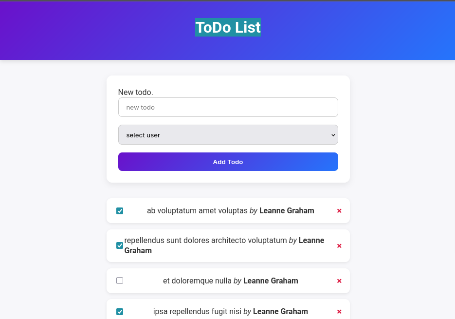

# 📝 ToDo List Application
## Test task

**Simple and functional ToDo List app built with Vanilla JavaScript and TypeScript.**

---

## 🚀 Features

- **User and Task Management**: Fetch and display users and their tasks from backend API.
- **CRUD Operations**: Create, Read, Update, and Delete tasks easily.
- **Interactive UI**: Dynamic updates on user actions.
- **TypeScript**: Type-safe code for reliability and maintainability.

---

## 💻 Technologies

- Vanilla JavaScript / TypeScript
- HTML & CSS
- Fetch API for backend integration
- Git & GitHub for version control

---

## 📸 Screenshot



---

## ⚡ How to Run

1. Clone the repo:  
   ```bash
   git clone https://github.com/OxY623/todoes-ts.git
